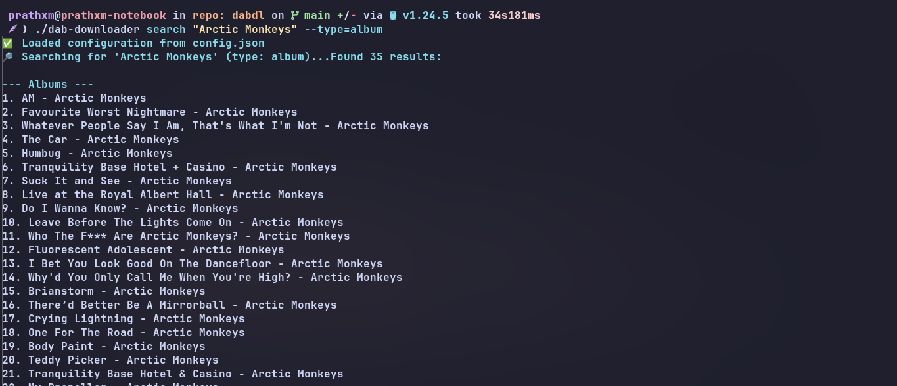
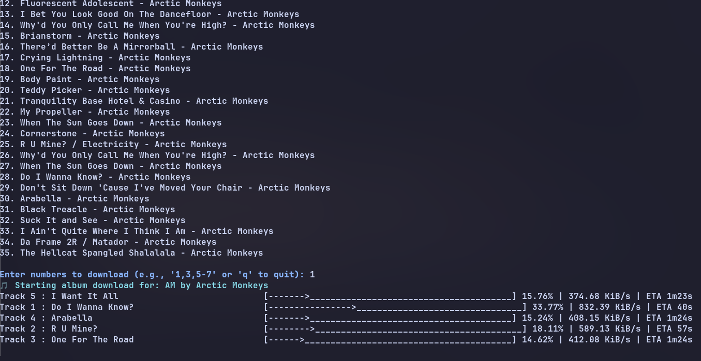

# 🎵 DAB Music Downloader

[](https://golang.org/dl/)
[](#license)
[](https://github.com/PrathxmOp/dab-downloader/releases)
[](https://signal.group/#CjQKIARVUX48EP6g9DSPb2n1v6fAkxGQvdJJSWc4KLa4KFVyEhDCRiJon09heXcckPnkX6k2)

> A powerful, modular music downloader that delivers high-quality FLAC files with comprehensive metadata support through the DAB API.

💬 **Need Help?** Join our [Signal Support Group](https://signal.group/#CjQKIARVUX48EP6g9DSPb2n1v6fAkxGQvdJJSWc4KLa4KFVyEhDCRiJon09heXcckPnkX6k2) for instant community support!
## 
## ✨ Key Features

🔍 **Smart Search** - Find artists, albums, and tracks with intelligent filtering  
📦 **Complete Discographies** - Download entire artist catalogs with automatic categorization  
🏷️ **Rich Metadata** - Full tag support including genre, composer, producer, ISRC, and copyright  
🎨 **High-Quality Artwork** - Embedded album covers in original resolution  
⚡ **Concurrent Downloads** - Fast parallel processing with real-time progress tracking  
🔄 **Intelligent Retry Logic** - Robust error handling for reliable downloads  
🎧 **Spotify Integration** - Import and download entire Spotify playlists and albums  
🎵 **Format Conversion** - Convert downloaded FLAC files to MP3, OGG, Opus with configurable bitrates (requires FFmpeg)  
📊 **Navidrome Support** - Seamless integration with your music server  

## 📸 Screenshots




## 🚀 Quick Start

### Option 1: Pre-built Binary (Recommended)

1. Download the latest release from our [GitHub Releases](https://github.com/PrathxmOp/dab-downloader/releases)
2. Extract and run the executable
3. Follow the interactive setup on first launch

### Option 2: Build from Source

**Prerequisites:**
- Go 1.19 or later ([Download here](https://golang.org/dl/))

```bash
# Clone the repository
git clone https://github.com/PrathxmOp/dab-downloader.git
cd dab-downloader

# Install dependencies and build
go mod tidy
go build -o dab-downloader
```

### Option 3: Docker (Containerized)

```bash
# Build and run with Docker Compose
docker compose build
mkdir config music
cp config/example-config.json config/config.json

# Run any command
docker compose run dab-downloader search "your favorite artist"
```

## 📋 Usage Guide

### 🔍 Search and Discover

```bash
# General search
./dab-downloader search "Arctic Monkeys"

# Targeted search
./dab-downloader search "AM" --type=album
./dab-downloader search "Do I Wanna Know" --type=track
./dab-downloader search "Alex Turner" --type=artist
```

### 📀 Download Content

```bash
# Download a specific album
./dab-downloader album <album_id>

# Download artist's complete discography
./dab-downloader artist <artist_id>

# Download with filters (non-interactive)
./dab-downloader artist <artist_id> --filter=albums,eps --no-confirm
```

### 🎧 Spotify Integration

**Setup:** Get your [Spotify API credentials](https://developer.spotify.com/dashboard/applications)

```bash
# Download entire Spotify playlist
./dab-downloader spotify <playlist_url>

# Download entire Spotify album
./dab-downloader spotify <album_url>

# Auto-download (no manual selection)
./dab-downloader spotify <playlist_url> --auto
```

### 🎵 Navidrome Integration

```bash
# Copy Spotify playlist to Navidrome
./dab-downloader navidrome <spotify_playlist_url>

# Add songs to existing playlist
./dab-downloader add-to-playlist <playlist_id> <song_id_1> <song_id_2>
```

## ⚙️ Configuration

### First-Time Setup

The application will guide you through initial configuration:

1. **DAB API URL** (e.g., `https://dab.yeet.su`)
2. **Download Directory** (e.g., `/home/user/Music`)
3. **Concurrent Downloads** (recommended: `5`)

### Configuration File

The application will create `config/config.json` on first run.
You can also create or modify it manually.
An example configuration is available at `config/example-config.json`.

```json
{
  "APIURL": "https://your-dab-api-url.com",
  "DownloadLocation": "/path/to/your/music/folder",
  "Parallelism": 5,
  "SpotifyClientID": "YOUR_SPOTIFY_CLIENT_ID",
  "SpotifyClientSecret": "YOUR_SPOTIFY_CLIENT_SECRET",
  "NavidromeURL": "https://your-navidrome-url.com",
  "NavidromeUsername": "your_navidrome_username",
  "NavidromePassword": "your_navidrome_password",
  "Format": "flac",
  "Bitrate": "320"
}
```

### Command-Line Options

Override configuration with flags:

```bash
--api-url               # Set DAB API endpoint
--download-location     # Set download directory
--debug                 # Enable verbose logging
--auto                  # Auto-download first results
--no-confirm            # Skip confirmation prompts
--format                # Specify output format (mp3, ogg, opus)
--bitrate               # Specify bitrate for lossy formats (e.g., 192, 256, 320)
--filter                # Filter by item type for artist downloads (albums, eps, singles)
--type                  # Type of content to search for (artist, album, track, all)
--spotify-client-id     # Your Spotify Client ID
--spotify-client-secret # Your Spotify Client Secret
--navidrome-url         # Your Navidrome URL
--navidrome-username    # Your Navidrome Username
--navidrome-password    # Your Navidrome Password
```

## 📁 File Organization

Your music library will be organized like this:

```
Music/
├── Arctic Monkeys/
│   ├── artist.jpg
│   ├── AM (2013)/
│   │   ├── cover.jpg
│   │   ├── 01 - Do I Wanna Know.flac
│   │   └── 02 - R U Mine.flac
│   ├── Humbug (2009)/
│   │   └── ...
│   └── Singles/
│       └── I Bet You Look Good on the Dancefloor.flac
```

## 🔧 Advanced Features

### Debug Tools

```bash
# Test API connectivity
./dab-downloader debug api-availability

# Test artist endpoints
./dab-downloader debug artist-endpoints <artist_id>

# Comprehensive debugging
./dab-downloader debug comprehensive-artist-debug <artist_id>
```

### Quality & Metadata

- **Audio Format:** FLAC (highest quality available), or converted to MP3/OGG/Opus
- **Metadata Tags:** Title, Artist, Album, Genre, Year, ISRC, Producer, Composer
- **Cover Art:** Original resolution, auto-format detection
- **File Naming:** Consistent, organized structure

## 🐛 Troubleshooting

<details>
<summary><strong>Common Issues & Solutions</strong></summary>

**"Failed to get album/artist/track"**
- ✅ Verify the ID is correct
- ✅ Check internet connection
- ✅ Confirm DAB API accessibility

**"Failed to create directory"**
- ✅ Check available disk space
- ✅ Verify write permissions
- ✅ Ensure valid file path

**"Download failed" or timeouts**
- ✅ App auto-retries failed downloads
- ✅ Check connection stability
- ✅ Some tracks may be unavailable

**Progress bars not showing**
- ✅ Run with `--debug` flag
- ✅ Check terminal compatibility
- ✅ Report output when filing issues

</details>

## 💬 Support

Need help or have questions? Join our community:

📱 **[Signal Support Group](https://signal.group/#CjQKIARVUX48EP6g9DSPb2n1v6fAkxGQvdJJSWc4KLa4KFVyEhDCRiJon09heXcckPnkX6k2)** - Get real-time help and connect with other users

🐛 **[GitHub Issues](https://github.com/PrathxmOp/dab-downloader/issues)** - Report bugs and request features

## 🏗️ Project Architecture

```
dab-downloader/
├── main.go              # CLI entry point
├── search.go            # Search functionality
├── api.go               # DAB API client
├── downloader.go        # Download engine
├── artist_downloader.go # Artist catalog handling
├── metadata.go          # FLAC metadata processing
├── spotify.go           # Spotify integration
├── navidrome.go         # Navidrome integration
├── utils.go             # Utility functions
└── docker-compose.yml   # Container setup
```

## 🤝 Contributing

We welcome contributions! Here's how you can help:

1. **🐛 Report bugs** - Use our issue templates
2. **💡 Suggest features** - Share your ideas
3. **🔧 Submit PRs** - Follow our contribution guidelines
4. **📖 Improve docs** - Help make things clearer

### Development Areas

- **API Client** (`api.go`) - Enhance endpoints and error handling
- **Metadata** (`metadata.go`) - Add new tag fields or formats
- **Downloads** (`downloader.go`) - Improve performance and features
- **Integrations** - Add support for new music services

## ⚖️ Legal Notice

This software is provided for **educational purposes only**. Users are responsible for:

- ✅ Complying with all applicable laws
- ✅ Respecting terms of service
- ✅ Only downloading content you legally own or have permission to access

## 📄 License

This project is provided under an educational license. See the [LICENSE](LICENSE) file for details.

## 🌟 Support the Project

If you find this project helpful:

- ⭐ Star this repository
- 🐛 Report issues and bugs
- 💡 Suggest new features
- 🤝 Contribute code or documentation
- 💬 Join our [Signal community](https://signal.group/#CjQKIARVUX48EP6g9DSPb2n1v6fAkxGQvdJJSWc4KLa4KFVyEhDCRiJon09heXcckPnkX6k2)

---

<div align="center">
  <strong>Made with ❤️ for music lovers</strong><br>
  <sub>Download responsibly • Respect artists • Support music</sub>
</div>