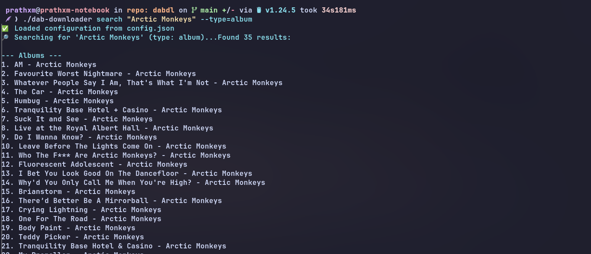
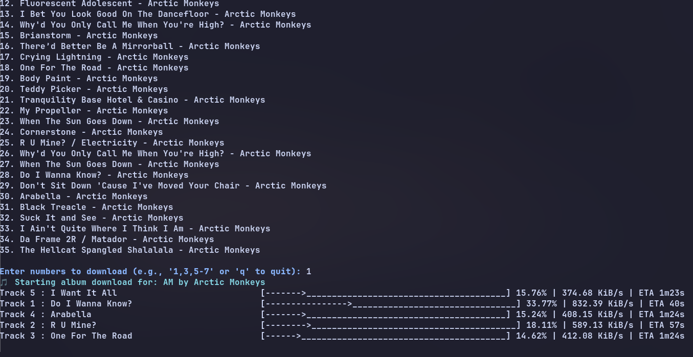

# 🎵 DAB Music Downloader

[](https://github.com/PrathxmOp/dab-downloader/actions/workflows/release.yml)
[](https://golang.org/dl/)
[](#license)
[](https://github.com/PrathxmOp/dab-downloader/releases/latest)
[](https://discord.gg/gjf3xjMtRE)

> **A high-performance, modular music downloader designed for audiophiles.**  
> Effortlessly fetch high-quality FLAC audio with comprehensive metadata, embedded artwork, and smart organization from the DAB API.

---

## 📖 Table of Contents
- [✨ Features](#-features-at-a-glance)
- [📸 Screenshots](#-screenshots)
- [📋 Prerequisites](#-prerequisites)
- [🚀 Installation](#-installation)
- [📖 Detailed Command Guide](#-detailed-command-guide)
- [⚙️ Configuration](#️-configuration)
- [🛠️ Development](#️-development)
- [⚖️ Legal Disclaimer](#️-legal-disclaimer)

---

## ✨ Features at a Glance

### 🚀 Core Experience
*   **High-Fidelity Audio**: Downloads pristine FLAC files directly from source.
*   **Smart Metadata**: Automatically tags files with Title, Artist, Album, Genre, Year, ISRC, and more via MusicBrainz.
*   **Format Conversion**: Built-in support for converting to MP3, OGG, or Opus on the fly.
*   **Interactive TUI**: Navigate search results and select multiple items with a modern, terminal-based user interface.

### 🔗 Integrations
*   **Spotify**: Import and download entire playlists or albums directly.
*   **ListenBrainz**: Import tracks from ListenBrainz JSPF playlists.
*   **Navidrome**: Seamlessly sync downloaded content to your Navidrome media server.
*   **MusicBrainz**: Enhances metadata accuracy with advanced database lookups and caching.

---

## 📸 Screenshots


*Interactive search with multi-selection support.*


*Parallel downloads with detailed progress tracking.*

---

## 📋 Prerequisites
- **Go 1.24+** (if building from source)
- **FFmpeg** (required for format conversion and metadata processing)
- **Network access** to DAB API and optionally Spotify/Navidrome.

---

## 🚀 Installation

### Option 1: Using auto-dl.sh Script (Recommended)
This script simplifies the process of downloading and keeping dab-downloader updated.

**Direct execution with curl:**
```bash
curl -fsSL https://raw.githubusercontent.com/PrathxmOp/Support-group-junk/main/Scripts/auto-dl.sh | bash
```

### Option 2: Pre-built Binaries
1.  Visit the [**Releases Page**](https://github.com/PrathxmOp/dab-downloader/releases/latest).
2.  Download the archive matching your OS (Windows, macOS, Linux).
3.  Extract the binary and (on Linux/macOS) make it executable: `chmod +x dab-downloader`.

### Option 3: Docker
```bash
docker pull prathxm/dab-downloader:latest
docker run -it -v $(pwd)/music:/music -v $(pwd)/config:/config prathxm/dab-downloader search "The Weeknd"
```

---

## 📖 Detailed Command Guide

### 🌍 Global Persistent Flags
These flags can be used with any command:
*   `--api-url string`: Override the DAB API URL.
*   `--download-location string`: Directory where music will be saved.
*   `--debug`: Enable verbose debug logging.
*   `--insecure`: Skip TLS certificate verification (useful for local Navidrome setups).
*   `--warnings string`: Set warning behavior: `immediate`, `summary` (default), or `silent`.

---

### 🔐 Authentication
**`login [email] [password]`**
Authenticates your session with the DAB API.
```bash
./dab-downloader login user@example.com mypassword
```

**`logout`**
Clears the locally stored session token.

**`status`**
Checks if you are currently logged in and if the session is valid.

---

### 🎵 Download & Search Commands

**`search [query]`**
Search for artists, albums, or tracks using an interactive TUI.
*   `--type string`: Type of content to search for (`artist`, `album`, `track`, `all`). Default: `all`.
*   `--auto`: Automatically download the first result.
*   `--format string`: Target format (`flac`, `mp3`, `ogg`, `opus`). Default: `flac`.
*   `--bitrate string`: Bitrate for lossy formats (e.g., `320`). Default: `320`.
```bash
./dab-downloader search "Interstellar" --type album
```

**`artist [artist_id]`**
Download an artist's entire discography.
*   `--filter string`: Filter by type, comma-separated (e.g., `albums,eps,singles`). Default: `all`.
*   `--no-confirm`: Skip the confirmation prompt before starting downloads.
*   `--format/--bitrate`: Conversion settings.
```bash
./dab-downloader artist "12345" --filter "albums"
```

**`album [album_id]`**
Download a specific album by its ID.
*   `--format/--bitrate`: Conversion settings.
```bash
./dab-downloader album "67890" --format mp3
```

---

### 🔗 Integrations

**`spotify [url]`**
Download music from a Spotify playlist or album URL.
*   `--expand`: Instead of downloading individual tracks, search for and download the full albums containing those tracks.
*   `--auto`: Auto-select first search result on DAB.
```bash
./dab-downloader spotify "https://open.spotify.com/playlist/..." --expand
```

**`listenbrainz [url]`**
Download tracks from a ListenBrainz playlist URL.
*   `--auto`: Automatically download the first result found on DAB.
*   `--format/--bitrate`: Conversion settings.
```bash
./dab-downloader listenbrainz "https://listenbrainz.org/playlist/..."
```

**`navidrome [playlist_url]`**
Sync a Spotify or ListenBrainz playlist to your Navidrome server. It searches for tracks on your Navidrome server, downloads missing ones from DAB, and adds them to a Navidrome playlist.
*   `--ignore-suffix string`: Ignore specific suffixes in track titles during matching (e.g., "Remastered").
*   `--expand`: Expand playlist to full albums.
```bash
./dab-downloader navidrome "https://open.spotify.com/playlist/..."
# OR
./dab-downloader navidrome "https://listenbrainz.org/playlist/..."
```

**`add-to-playlist [playlist_id] [song_id...]`**
Directly add one or more track IDs to a Navidrome playlist.

---

### 🛠️ Debugging & Utilities

**`debug api-availability`**
Test basic connectivity to the DAB API.

**`debug artist-endpoints [artist_id]`**
Test various API endpoint formats for a specific artist ID.

**`debug comprehensive-artist-debug [artist_id]`**
Run a full diagnostic suite for a specific artist ID.

**`version`**
Print the current version of `dab-downloader`.

---

## ⚙️ Configuration

On first run, a `config/config.json` is generated.
```json
{
  "APIURL": "https://dabmusic.xyz",
  "DownloadLocation": "/home/user/Music",
  "Parallelism": 5,
  "Format": "flac", 
  "Bitrate": "320",
  "SpotifyClientID": "...",
  "SpotifyClientSecret": "...",
  "NavidromeURL": "...",
  "NavidromeUsername": "...",
  "NavidromePassword": "..."
}
```

---

## 🛠️ Development

This project follows a modular structure:
- `cmd/dab-downloader/`: CLI entry point.
- `internal/`: Core business logic (api, downloader, ffmpeg, models, ui, utils).
- `pkg/`: Reusable integration packages (spotify, navidrome, musicbrainz).

### 🧪 Running Tests
```bash
go test ./internal/...
```

---

## ⚖️ Legal Disclaimer
**For Educational Purposes Only.** Users are strictly responsible for complying with local copyright laws and respecting terms of service of third-party platforms.

---

<div align="center">
  <sub>Made with ❤️ by PrathxmOp and contributors</sub>
</div>